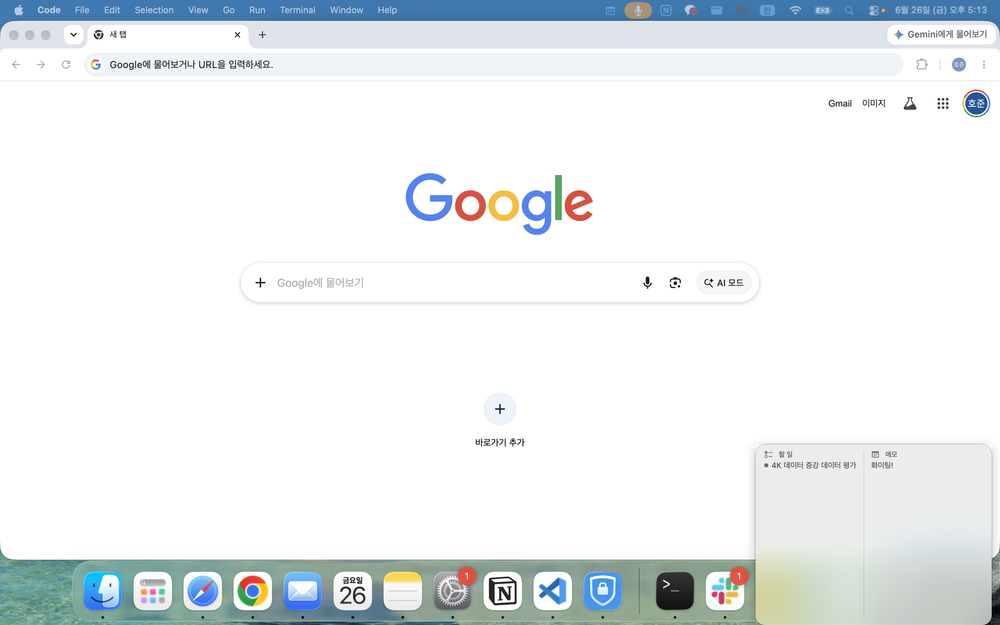
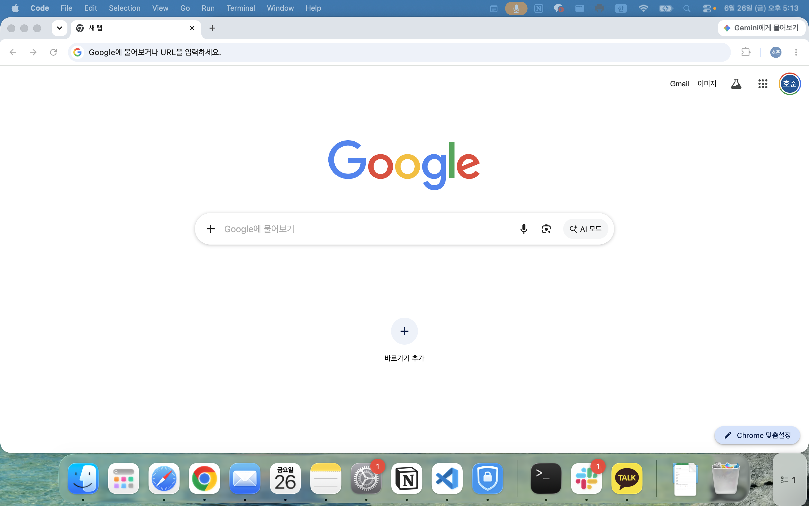

<div align="center">

# 📝 MyMemo

**맥북 독(Dock) 옆에 붙어 다니는 할 일 · 메모 패널**

테두리 없는 길쭉한 플로팅 패널이 독 옆 빈 공간에 딱 붙어, 중요한 할 일과 메모를 항상 보여줍니다.




</div>

---

## ✨ 핵심 기능

| | |
|---|---|
| 🧲 **독 옆에 착** | 테두리 없는 반투명 패널이 독 옆 빈 공간에 자동으로 붙습니다. 포커스를 뺏지 않고, 모든 Space에 표시됩니다. |
| 🖥️ **독을 따라 이동** | 멀티 모니터에서 독이 다른 화면으로 넘어가면 패널도 그 화면 독 옆으로 따라갑니다. |
| ⭐ **자동 하이라이트** | 별표(중요) → 마감 임박 순으로 상위 항목만 골라 패널에 표시 (완료 항목 제외). |
| 🔍 **올리면 펼침** | 좁을 땐 작게 두고, 마우스를 올리면 독 위로 커지며 전체 내용을 보여줬다가 다시 접힙니다. |
| 📐 **위치·폭 고정** | "수정하기"로 드래그·폭 조절 후 **모니터별로** 저장해 둘 수 있습니다. |
| ✍️ **별도 편집 창** | 추가 · 완료 · 별표 · 마감일 · 삭제 + 메모 편집. 메뉴바 아이콘이나 패널 더블클릭으로 열기. |
| 💾 **로컬 전용** | 완전 오프라인. 계정·클라우드 없음. 데이터는 `~/Library/Application Support/MyMemo/data.json`. |

---

## 📸 스크린샷

<table>
  <tr>
    <td align="center" width="50%">
      <br/>
      <sub><b>독 옆에 붙은 패널</b> — 할 일 + 메모를 항상 표시</sub>
    </td>
    <td align="center" width="50%">
      <br/>
      <sub><b>멀티 모니터</b> — 다른 화면에서도 독 옆에</sub>
    </td>
  </tr>
  <tr>
    <td align="center" colspan="2">
      <br/>
      <sub><b>독 크기에 맞춤</b> — 독이 넓어지면 남는 공간에 맞춰 자동으로 좁아짐</sub>
    </td>
  </tr>
</table>

---

## 🚀 빌드 & 실행

> **요구 사항** — macOS 14 (Sonoma) 이상 · Swift 6 (Xcode 불필요, Command Line Tools로 빌드 가능)

```bash
git clone https://github.com/hojuna/MyMemo.git
cd MyMemo

swift build                  # 빌드
bash scripts/make-app.sh     # MyMemo.app 번들 생성
open MyMemo.app              # 실행 → 메뉴바에 📝 아이콘 등장
```

핵심 로직 검증:

```bash
swift run MyMemoCheck        # HighlightRule / 영속화 단위 검증
```

---

## 🧭 사용법

1. 실행하면 **독 옆**에 패널이 뜨고, **메뉴바에 📝 아이콘**이 생깁니다.
2. 📝 아이콘 → **"메모 편집창 열기"** (또는 패널 **더블클릭**)으로 편집 창을 엽니다.
3. 할 일을 추가하고, 왼쪽 **동그라미로 완료**, **별표로 중요** 표시, 마감일을 지정합니다.
4. 중요·마감 임박 항목이 자동으로 **독 옆 패널**에 나타납니다.
5. 패널을 원하는 위치·폭으로 두고 싶으면 편집창 아래 **"패널 위치·폭 수정하기"** → 드래그·슬라이더 → **저장** (그 모니터에 고정됩니다).

---

## 🏗️ 구조

```
Sources/
  App/          @main 진입점 + AppDelegate (패널·편집창·메뉴바 와이어링)
  Core/         라이브러리 (MyMemoCore)
    Model/      Todo · Memo · AppData
    Store/      AppStore(단일 소스) · PersistenceManager · PanelLayout
    Logic/      HighlightRule (결정적 정렬·필터)
    Panel/      FloatingPanel(NSPanel) · PanelWindowController · PanelContentView
    StatusItem/ 메뉴바 상태 아이콘
    Editor/     편집 창 SwiftUI 뷰
  Check/        CLI 검증 실행 타깃
Tests/          swift-testing 단위 테스트
scripts/
  make-app.sh   .app 번들 래퍼
```

**설계 메모** — 단일 `AppStore`(`@MainActor @Observable`)가 패널과 편집창 양쪽의 유일한 소스입니다.
패널은 비활성(nonactivating) `NSPanel`로 포커스를 뺏지 않으며, 독 위치는 화면 인셋으로 감지해 따라갑니다.
저장은 디바운스된 JSON 파일 쓰기(로컬 전용).

---

<div align="center">
<sub>개인 프로젝트 · macOS 네이티브 · Swift 6</sub>
</div>
